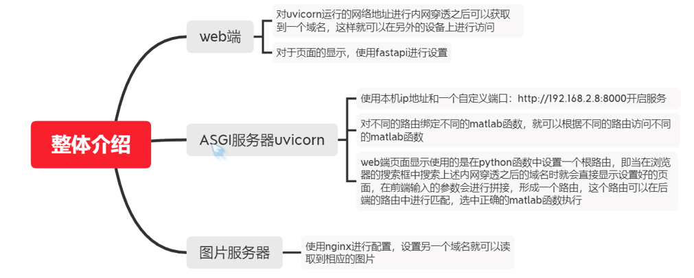
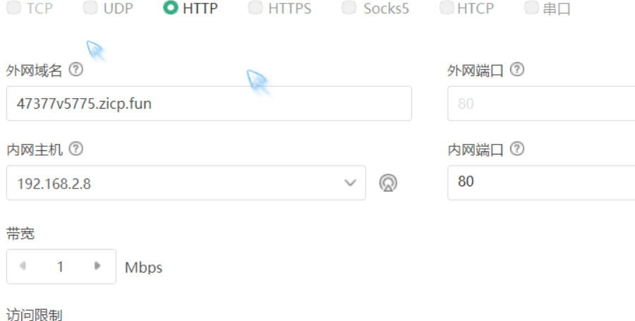
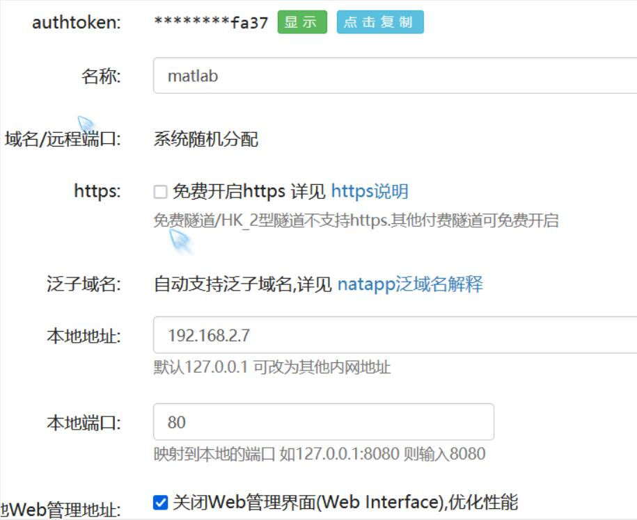
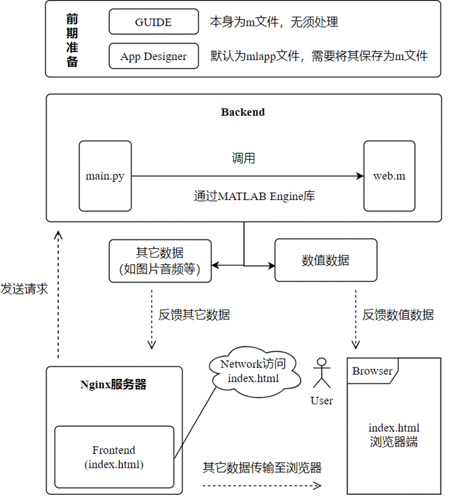
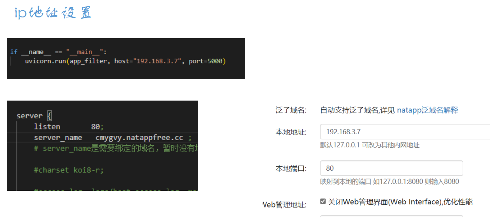
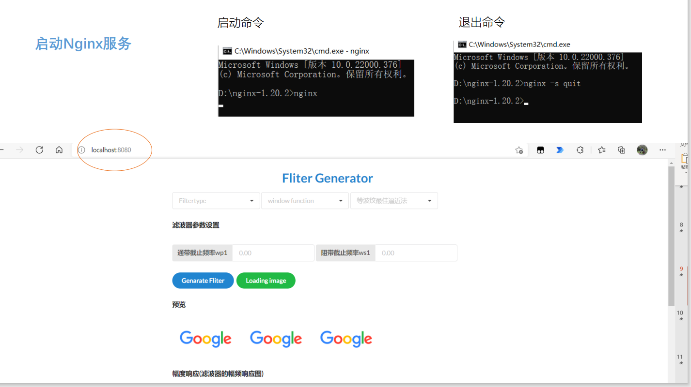
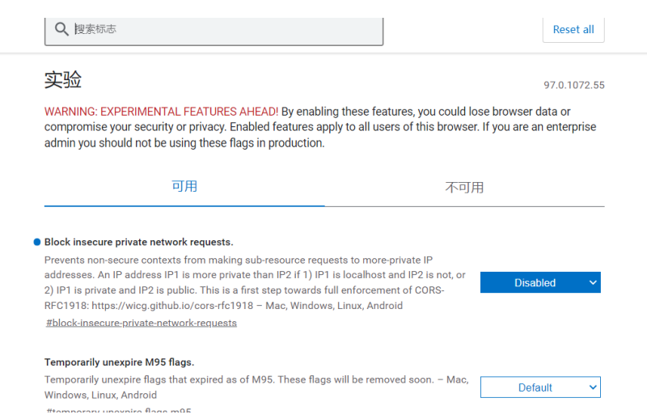
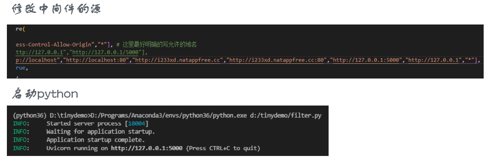
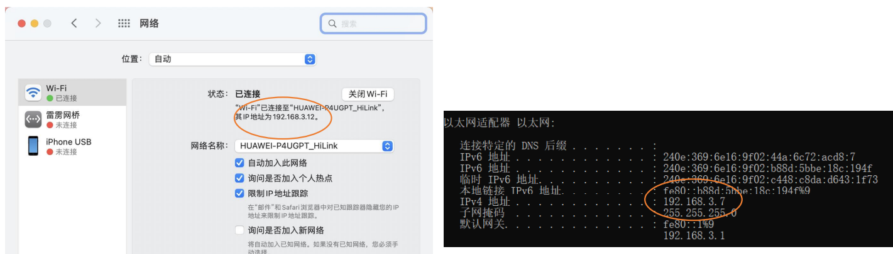
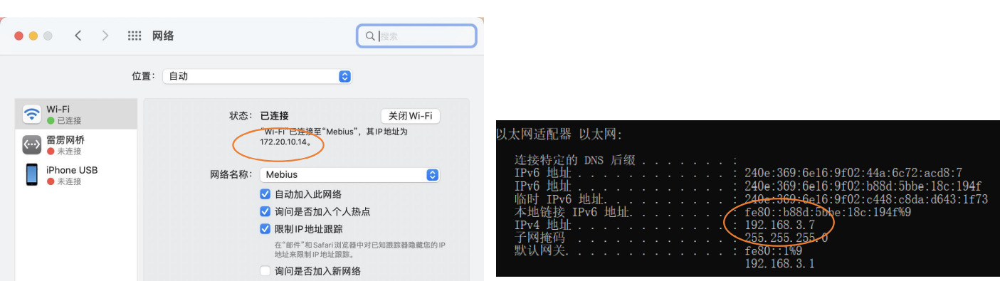

[Tips]如果遇到图片加载不出来问题，可能是遇到了DNS污染，
可以通过https://www.ipaddress.com/ 获取到 raw.githubusercontent.com 的真实ip，并将其添加至C:\Windows\System32\drivers\etc\hosts 中
如：
185.199.108.133 raw.githubusercontent.com
185.199.109.133 raw.githubusercontent.com
185.199.110.133 raw.githubusercontent.com
185.199.111.133 raw.githubusercontent.com

# -MATLAB-Web-App-Server-

本项目是为有效解决当前MATLAB Web App Server部署web应用后加载极其缓慢，且无法兼容chrome49内核浏览器，无法进行三方优化等痛点创建。

**目前部署MATLAB Web App 到云端有两种方案：**

（1）使用官方提供的MATLAB Web App Server工具或MATLAB Production Server工具完成部署；

（2）通过本仓库的方法实现（以下两种方法总体思想相同，实现方式不同）。

# -视频演示

后续补充

# -方法详致解说

## -方法一

示意图：

该方法采用通过对uvicorn进行nat内网穿透达到用户外网访问的效果，这里使用的是花生壳进行穿透，提交数据后，数值数据直接返回至浏览器端，图片等其它数据传至nginx服务器，再通过响应图片按钮加载资源

> **Backend**

后端主程序：后端使用python作为开发语言。python与matlab之间可以相互调用，只需要安装matlab提供的接口包：matlab engine for python，这样就可以使用python调用matlab函数进行计算。

后端框架：使用python的fastapi异步web框架来实现前后端交互的功能。

后端服务器：使用python ASGI框架的HTTP服务器-uvicorn。

> **Frontend**

前端：使用html进行简单页面的设计，使用vue前端框架中的axios来向后台发送请求，使用其中的get方法实现前后端的数据交互。

> **Nginx Server**

Nginx服务器：用于搭建图片服务器，在后端计算完之后用于将计算得到的图片渲染到前端页面中。后端计算完成之后将图片保存在本地，在nginx的配置中进行配置在访问相应的域名时就可以使用图片保存时的名字访问到这个图片。

> **内网穿透**

可以使用免费的natapp进行内网穿透，但是缺点是免费的域名在natapp关闭重开之后就会发生变化，这就会需要重新进行配置。

**花生壳设置图下**： 

 

**图床服务器穿透设置**： 

 

**Nginx服务器配置**： 

 

## -方法二

示意图：

> **Backend**

-  **后端主程序：**后端使用`Python`作为开发语言，因为`MATLAB`提供给`Python`一个`MATLAB engine API`的包供 `Python `将 `MATLAB `作为计算引擎来调用；

-  **后端框架：**后端使用`python`的三方库`fastapi`作为后端异步框架，供予前后端异步交流；

-  **后端服务器：**后端采用轻量快速的 `Python ASGI `框架 `Uvicorn`作为异步服务器使用。

>  **Frontend**

-  **前端：**这里使用的`Semantic UI`作为前框框架绘制页面，选择`jQuery`作为`JavaScript`库编写应用函数，使用`vue`前端框架创建于后端连接的`RESTful API`。

>  **Nginx Server**

**Nginx服务器**：用于部署静态资源，如主页面`index.html`、`semantic UI.css`、`jquert.js`以及默认加载图片等都是存储在该服务器上，用户访问的页面就是从该服务器获取的。同时该服务还会接收后端调用`m脚本`后生成的其它资源，如图片等。

**概括**：用户通过浏览器访问目标地址，目标地址通过`nginx`服务器反馈相关静态资源呈现在浏览器上，当用户对其操作并向后端发送请求后，后端`main.pyton`通过调用同级目录下的`m文件`实现计算，计算后后端程序将数值数据直接反馈给浏览器，将图片等其它资源保存至`Nginx`服务器端，用户在浏览器上通过`加载图片`按钮，向`Nginx`服务器发送请求，获取图片资源。

### Nginx配置

**配置信息**：主要是监控端口和绑定的ip地址

下面是后端程序、Nginx服务器、以及NAT对地址的设置

其中cmygvy.natappfree.cc是外网访问目标页面的地址；192.168.3.7是本机ipv4地址；

**启动方法**：命令行启动与关闭

### 浏览器设置

因为存在跨域安全问题，这里需要在浏览器地址栏搜索chrome://flads进入设置，然后将Block insecure private network requests`改为`disabled`。

### 后端配置

后端最好将主程序main.py和matlab的m文件放在同一目录下，否则偶尔会出现matlab engine找不到根路径的问题，需要强制cd到指定目录。

### 存在问题

（1）在多台主机测试的时候发现，两台主机必须处于同一wifi下，

下面不行

